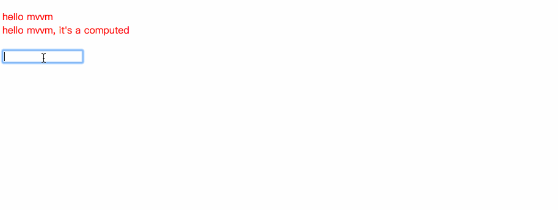
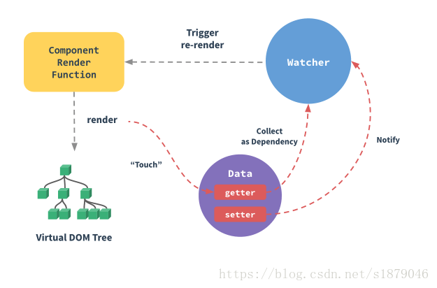

# MVVM
### 背景
本次实现MVVM是在阅读分析 [Vue源码](https://github.com/vuejs/vue) 背景下产生的，而之所以看Vue.js主要是平时中主要使用Vue.js框架，在分析了Vue.js相关源码之后，就结合Vue.js中的处理逻辑自己动手写了个简易版的MVVM，便于自己学习理解。

> 简易MVVM的实现注有详细的注释（好记性不如乱笔头）

### 说明
最新vue.js源码的代码量对于现在的我来说，面面俱到是很有难度的，所以就从最简单的开始，即基于简单的实例来分析Vue.js关于此的相关处理。

这里需要重点说明一下：MVVM的实现思想就是分析Vue.js源码而来，只是有些部分具体实现不同而已。

简单实例示例：

```html
<div id="app">
  {{ text }}
  <div> {{ getText }}</div>
<div>
```

### 功能实现
本次简易MVVM实现的功能点如下：

- 双向绑定：目前只实现了data、computed部分
- render函数的构建：即解析templte构建render函数
- VNode（虚拟DOM）：简易的虚拟DOM对象
- VNode转换HTML的过程

本次实现MVVM所实现的功能比较单一而且只支持单挂载点形式，即只支持{{}}形式，不支持Vue.js中指令、filters等相关。

本版本MVVM的实现是基于简单实例的，实现的功能比较单一，**但是通过本版本MVVM实现整个解析过程**，可以学习到的知识点如下：

- 双向绑定，Vue.js中核心点之一
- data以及computed响应式原理的相同以及不同点
- 解析template构建成ast、ast构建成render的实现思路
- VNode（虚拟DOM）的形式（目前这里只是架子，其精髓并未实现，还需要具体去研究Vue.js源码）
- 替换浏览器DOM的具体实现

### 具体效果


### MVVM中重要几点实现逻辑
宏观上MVVM上实际上就两点主要的：   

- 响应式原理相关的
- $mount挂载导致的一系列处理

#### 响应式原理
响应式原理的实现其中涉及到如下几点：

- Observer观察者对象
- Dep依赖对象
- Watcher监听依赖对象

这里分为两个部分：data、computed，它们的实现是存在区别的，主要是的两点区别：

- computed是具有缓存性质的
- computed所对应的Watcher依赖收集不完全相同于data



**data**

关于data的响应式处理，Vue.js中的主要处理流程可以看下面的Vue之data处理及挂载文章。

本次MVVM中关于这边的处理，主要处理逻辑如下：
> _init -> initState -> initData -> proxy -> Observer -> walk -> defineReactive

每一个函数的作用都有详细注释。  

**computed**
本次computed中主要的处理逻辑如下：
> _init -> initState -> initComputed -> Watcher -> defineComputed

#### $mount挂载
$mount这个过程过程会触发：

- data对应的Watcher对象的构建
- render函数的构建
- VNode的创建
- Vnode转换为真实DOM

**data对应Watcher实现**    

MVVM中关于此处的主要处理逻辑如下：
> _init -> $mount -> new Watcher

**render函数构建及调用**    

MVVM中关于此处的主要处理逻辑如下：   
> _init -> $mount -> compile生成render函数

> compile -> parse生成ast -> generate生成code -> new Function

关于render函数的调用是data对应的Watcher对象创建触发的，MVVM此处的主要实现逻辑如下：
> new Watcher -> Watcher实例方法get调用 -> 触发_render函数方法 -> 触发_update实例方法

**Vnode的创建以及转换为真实DOM**   

MVVM关于此处的处理如下：
> _update -> _patch -> createElm + removeVnodes


### 相关文章
在分析Vue.js源码过程中，写下了几篇差强人意的文章便于之后回顾完善（实际上我推荐直接看代码，debugger才是王道），具体链接如下：

- [Vue初始化](https://blog.csdn.net/s1879046/article/details/82049968)
- [Vue之data处理及挂载](https://blog.csdn.net/s1879046/article/details/82151666)
- [Vue之computed](https://blog.csdn.net/s1879046/article/details/82381468)
- [Vue之render构建+调用](https://blog.csdn.net/s1879046/article/details/82881751)
- [Vue之解析template](https://blog.csdn.net/s1879046/article/details/82662704)
- [Vue之Vnode创建](https://blog.csdn.net/s1879046/article/details/82910130)
- [Vue之vnode转换为真实DOM](https://blog.csdn.net/s1879046/article/details/82979954)


